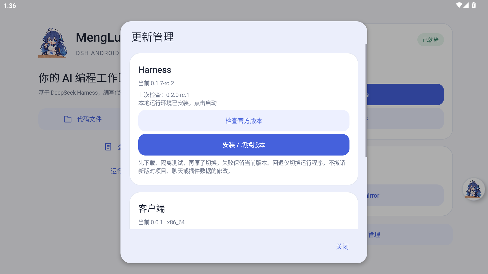

# MengLuo DSH Android

基于 DeepSeek Harness 的非官方 Android 客户端。编写代码、运行脚本、管理项目，保留 Harness 的原生界面。

[下载 APK](https://github.com/Coyami-Mengluo/mengluo-dsh-android/releases/latest) · [更新记录](CHANGELOG.md) · [更新机制与发布说明](docs/UPDATES.md) · [Windows 客户端](https://github.com/Coyami-Mengluo/mengluo-dsh-desktop)

## 安装

Android 11 及以上。普通手机下载 `arm64-v8a.apk`，MuMu 等 x86_64 模拟器下载 `x86_64.apk`。打开 App 后选择下载源，在“更新管理”选择 Harness 版本并安装，然后启动；在 Harness 中配置自己的模型 API。首次安装需要联网，建议预留至少 2 GB 空间。

**当前为早期公开版本；ARM64 包尚未经真机运行验证。** MuMu 的转译与 Permissive SELinux 环境不能替代真实手机验证。请先导出重要文件，不保证所有手机、插件、沙箱与浏览器自动化功能可用。

## 功能



- App 内可拖动的图标菜单，闲置或拖动松手后贴边半隐藏，只留 24dp 的半透明入口；点击直接打开菜单，拖动时恢复完整显示，保留左右位置与高度。仅图标附近保留手势触摸区域，不影响其余边缘返回操作。不申请 `SYSTEM_ALERT_WINDOW`，不显示在其他 App 上方。
- Material 3 卡片、底部菜单与弹窗，跟随系统浅色 / 深色主题。首页、官方页面及悬浮球使用系统导航栏、刘海与键盘的实际安全区；底部菜单避让手势条，不累加空白高度。
- Ubuntu Base / Node 在首次安装时按需下载并核对 SHA-256，PRoot 小型原生工具随包提供。已有基础环境不随壳更新重复下载。
- Harness 官方版本目录、候选安装和启动测试、版本切换及上一版回退；项目、插件和运行程序分别存放。失败不切换到候选版本。
- 客户端自更新：每天检查、同一更新不重复提醒、手动下载与真实进度；校验包名、版本、签名、哈希及架构后交由安卓系统确认安装。完整小 APK 更新，不是二进制差分。
- 首次安装页及图标菜单可选官方源 / 国内 npmmirror、USTC 镜像。Harness 和配套 pnpm 依赖由官方源确定并锁定，镜像只下载对应字节；镜像缺少目标版本时明确报错。基础 Node / Ubuntu 归档使用 npmmirror / USTC 镜像，失败时明确提示并回退到同一版本的官方地址。Ubuntu 安装依赖也跟随选择，下载失败回退官方源，保留 HTTPS 和官方签名校验。GitHub 地址及手动 apt 命令的源配置不变；已运行的 Harness 需重启才能继承新设置。
- 本地启动 / 停止、安装阶段和错误摘要、带停止按钮的前台通知。“运行日志 → 导出日志”通过系统文件选择器保存近期历史记录（最多 3 MiB，含重启前日志），不只导出屏幕上的片段。常见凭据已脱敏，分享前仍需检查私人内容。
- “代码文件”读取 Harness 已保存的项目目录，提供项目切换、文本编辑、系统文件选择器导入/导出；包括默认 `/workspace`、`/root/项目名` 等 App 私有项目，以及当前选中的公共工作目录。“导入 / 导出”可导出当前文件夹或整个项目，保存为手机文件夹或 ZIP，保留子目录、空文件夹及隐藏文件。提供进度与取消，导出至新目录，不覆盖已有目录；原项目不搬移，导入导出本身不需要全盘文件权限。文件列表分页显示；二进制和大文件可单独导出，保存或导入不覆盖已发现的并发修改 / 同名文件。
- 首页与悬浮菜单提供“工作目录”：可以选择、新建手机内部存储中的公共项目文件夹，让 Harness 和终端直接读写原目录并在其中运行脚本；需用户主动授予所有文件访问，默认不申请。Linux 运行环境和配置仍在应用内部，原 `/workspace` 保持不变。
- 本机 Bash/Node 命令入口、手动插件安装和列表；不是 Windows 版完整插件商店，不自动更新插件。
- 首次安装页提供可关闭的运行权限说明；当前官方页面出现明确的 Bash 沙箱不可用信息时，在悬浮图标旁显示可关闭的小气泡，最多自动提醒一次，记录会保留至重启后。可在气泡或运行环境页主动查看切换「完全访问 / Full access」的方法与风险；不会自动修改权限、执行重试或把普通运行错误归为沙箱问题。
- 不包含手机点击/滑动等控制，不申请无障碍、Root 或录屏权限。

运行权限不会由客户端自动放开；需要时只说明如何在官方界面选择“完全访问”及其风险。

### 自定义工作目录

打开“工作目录 → 选择手机文件夹”，阅读权限说明后在系统设置中允许所有文件访问，再选择一个具体项目文件夹（可新建）。不选择整个存储根目录或 `Android` 应用数据目录。运行中的 Harness 会先请求确认停止；不会自动迁移、合并或删除任何项目。拒绝授权时仍可使用应用内目录与导入导出。

所选路径在 Harness 与手机文件管理器中相同，例如 `/storage/emulated/0/Documents/MyProject`。终端的当前目录直接指向这里；官方界面的新项目可使用“复制 Harness 路径”，在工作区选择器中选中该目录。旧会话仍使用原来的项目路径，不会被悄悄指向另一份文件；换回应用内目录只改变启动位置。一次只接入当前选中的公共目录，使用旧公共项目时重新选中它。权限撤销或目录被移动后会报错，不创建替代目录或自动回退。

使用内部的解释器执行公共目录中的脚本，例如 `node app.js`、`python3 main.py`、`bash run.sh`；能否运行取决于项目所需依赖。公共存储缺少完整 Linux 文件系统能力，软链接、可执行二进制、部分 npm/pnpm 依赖和编译工具仍可能失败，不能保证所有项目可运行。需要这些能力的项目应使用应用内工作区；不会自动把依赖搬到隐藏位置，也不修改官方 Harness 权限配置。

## 构建

需要 Windows、Node 24、JDK 21。SDK、Gradle、下载缓存和调试密钥保存在工程的 `.tools/`，不修改系统 PATH。先阅读并接受 [Android SDK 许可](https://developer.android.com/studio/terms)。

```powershell
node scripts/prepare-tools.mjs
node scripts/prepare-runtime.mjs
# 使用 .tools/android-sdk/cmdline-tools/19.0/bin/sdkmanager.bat --licenses 接受 SDK 许可
./scripts/build.ps1
```

APK 位于 `app/build/outputs/apk/debug/app-debug.apk`，仅用于开发调试；公开安装包使用非调试 release 构建与维护者长期签名。其他开发者自行生成的调试密钥不能覆盖官方仓库签名的客户端。源代码测试：`./scripts/build.ps1 -Tasks testDebugUnitTest,lintDebug`。发布方法见 [UPDATES.md](docs/UPDATES.md)。

ARM64 手机测试包：

```powershell
node scripts/prepare-runtime.mjs arm64-v8a
./scripts/build.ps1 -Abi arm64-v8a
node scripts/verify-apk.mjs arm64-v8a
```

输出为 `app/build-arm64/outputs/apk/debug/app-debug.apk`，与模拟器包分开构建和存放。PRoot 与基础环境清单按架构打包；Ubuntu Base、Node 按清单在首次运行时下载。安装记录包含 ABI，并在启动前检查 ELF 架构。构建与静态校验通过不代表真机可运行。

设备集成测试运行在 App UID 内，检查解压安装、Node 执行代码写文件、npm/pnpm 镜像、Harness HTTP 与前端就绪及停止后保留文件。不消耗模型额度，不替代真实模型工具调用、后台保活或真实手机测试。

`AptSetupDeviceTest` 可通过 instrumentation 参数 `aptFixturePath` 指定已校验的 Ubuntu Base 归档，在全新缓存目录中测试真实依赖安装。测试专用 seccomp 过滤器仅拒绝该子进程树的原生 `link/linkat`：先确认关闭兼容会出现 `status-old: Permission denied`，再确认开启兼容后同一失败数据库可以恢复、软件包可以安装和升级。过滤器按实际 ELF 架构选择，避免模拟器伪装的 `uname` 误导；不改 SELinux、不申请 Root，也不操作用户的包数据库。`UpgradeRetentionTest` 的 `upgradeRetentionPhase=prepare/verify` 可在覆盖安装前后核对运行版本状态、临时项目文件和下载源保留情况。

先构建 `assembleDebug,assembleDebugAndroidTest`，再运行 `./scripts/device-smoke.ps1`。其中界面用例覆盖横竖屏、深色模式及模拟的手势条 / 侧边导航栏 / 键盘安全区，验证重复分发不会叠加留白。MuMu 当前隐藏系统导航栏，因此这不等于手势导航真机实测。`node scripts/read-ui-verification.mjs` 可取回界面测试截图到 `.tools/verification/`。

MuMu 自带的旧 WebView 缺少 `Promise.withResolvers` 和 `AbortSignal.any`。App 仅在当前 Harness 本地 origin 的文档启动阶段补齐这两个缺失接口，已有原生接口不覆盖，不修改官方文件或增加原生权限桥接；兼容脚本测试：`node --test scripts/web-compat.test.mjs`。它不替代浏览器安全更新，也不代表兼容任意老旧 WebView。

## 安全和限制

PRoot 是用户态兼容工具，**不是可靠的安全隔离边界**；实际权限边界是 Android App UID。用户命令、Harness 和插件能访问本 App 的工作区和模型配置；只运行可信代码，不要运行不可信插件。API 配置不纳入 Android 自动备份。运行日志不应直接公开，插件仍可能输出私密内容。

默认只有 App 私有文件权限；导入产生独立副本，导出需用户选择目标。可选的公共工作目录使用 `MANAGE_EXTERNAL_STORAGE`，需用户在系统设置中主动授权。**该权限不只覆盖所选文件夹**：Harness、插件和用户命令获得 App 可访问的其他公共文件权限，所选工作目录和 PRoot 绑定不是安全沙箱。它不赋予 Root，也不开放其他 App 的私有数据。此权限和 Harness 的「完全访问」模式相互独立；上架 Google Play 时需另行满足广泛存储权限政策。

普通文件编辑器目前只处理不超过 2 MB 的文本，单文件导入上限 32 MB。应用卸载或系统设置中“清除数据”会删除应用内工作区、运行环境和模型配置；选中的普通公共文件夹不会由客户端删除，仍应备份重要代码。

文件夹导出是一次性副本，不是双向同步。单次上限为 2 GiB、50,000 个条目、64 层子目录；符号链接、特殊文件及运行时配置路径会跳过并列出，目录中自己的隐藏文件（如 `.env`）仍会包含，分享前请检查。导出前应暂停修改该项目；检测到文件变化会失败而非宣称副本完整。取消或失败后，手机目标目录可能留下带 `.incomplete` 标记的部分副本，需用户确认后自行删除。Android 11 及以上不允许通过系统目录选择器访问 `Android/data`，可选择 `Documents` 下的自建目录。

仅允许当前 Harness 的确切 loopback 端口留在 WebView；外链由用户确认后交给浏览器。WebView 无 JavaScript 原生特权桥接。停止运行环境会中止当前任务。后台前台服务不等于永久保活，系统仍可能结束进程。

本地框架是否能使用 Bash 沙箱、原生模块、全部插件或构建特定类型的软件，必须逐项测试。不会通过全局关闭 Android 安全机制或默默关闭 Harness 权限检查来宣称兼容。

### 当前已确认的工具限制

MuMu（Android 12、Linux 5.4.32）上的官方 Harness `0.1.7-rc.2` 在模型调用 `workspace-write` Bash 工具时会报告没有可用沙箱后端。配套 Landlock 原生程序已安装，但实际探测显示内核不支持或未启用。单独解压 Ubuntu bubblewrap 做隔离测试后，其启动探测虽然退出 0，“只读”配置却仍可写入测试文件，`workspace-write` 配置也会失败；因此不能仅以探测退出码判断 PRoot 下的隔离有效，也没有把 bubblewrap 作为修复安装进运行环境。

终端中的普通 Bash / Node / Python 命令测试通过，不等于模型的受限 Bash 工具已经适配。当前不打包 Chromium / Playwright，也尚未验证浏览器渲染、截图和依赖这些工具的任务。上述结论只针对当前实测环境；ARM64 真机需独立测试，不自动切换为完全访问权限。

权限提醒只观察当前确切 Harness origin 的顶层页面中已渲染的错误卡片 / 助手回答，忽略输入框、用户消息、隐藏内容和回答中的代码引用。监听按变更合并并限制扫描量；向原生界面只发送固定提示事件，不传出对话内容，也不访问模型、会话文件或设置接口。提醒是基于页面文字的辅助说明，不是内核能力检测；官方 DOM 或措辞变化可能影响识别。「完全访问」会放开 Harness 工作区限制并减少操作确认，命令可能访问本 App 的其他项目、配置和密钥；Android 的应用隔离仍生效，缺少依赖等问题不由此解决。

项目文件回归测试使用 App 缓存内的独立数据，不读取或改写真实聊天与密钥：构建 `assembleDebugAndroidTest` 后运行 `ai.mengluo.dsh.android.ProjectBrowserTest`。它覆盖项目索引、损坏记录回退、符号链接拒绝、文件选择器状态恢复，以及项目列表到编辑器的实际界面链路。代码浏览器不开放运行时和 `/root/.dsh` 配置目录；符号链接目录请在 Harness 中重新选择实际项目路径。

公共目录设备测试需显式启用，普通测试运行时会跳过：在已安装运行环境的独立测试设备上授予所有文件访问，指定 `ExternalWorkspaceTest` 并传入 `-e externalWorkspaceTests true`，验证原目录读写、脚本与本地服务、Harness 隔离配置启动和目录选择界面。`WorkspacePermissionRestartTest` 分别传入 `-e workspacePermissionPhase prepare/denied/verify`；在 prepare 后通过系统或 ADB 撤销权限，运行 denied，再重新授权运行 verify。系统撤销权限会结束 App 进程，必须在 instrumentation 之外操作。结束后恢复测试前的权限状态；不要在真实使用中的设备运行权限撤销测试。测试只清理自己创建的临时项目，不读取或更改用户项目和模型配置。

## 第三方运行工具

项目自有源码采用 [MIT](LICENSE)。第三方组件保留各自许可，MIT 不替代 GPL / BSD / Apache 等上游条款。两个 `runtime-lock` 文件记录各架构的下载地址与 SHA-256；Ubuntu 各包许可位于安装环境 `/usr/share/doc/`，Node 许可为 `/opt/node/LICENSE`。

公开 Release 同时提供 `native-corresponding-source.tar.gz`，包含 APK 内 PRoot、libtalloc、libandroid-shmem 的对应源码与固定提交的 Termux 构建脚本 / 补丁。详见 [NOTICE](NOTICE)、[原生组件源码说明](docs/NATIVE-SOURCES.md) 和 APK `assets/notices/`。项目不附带 API 密钥、聊天数据或维护者签名私钥。
